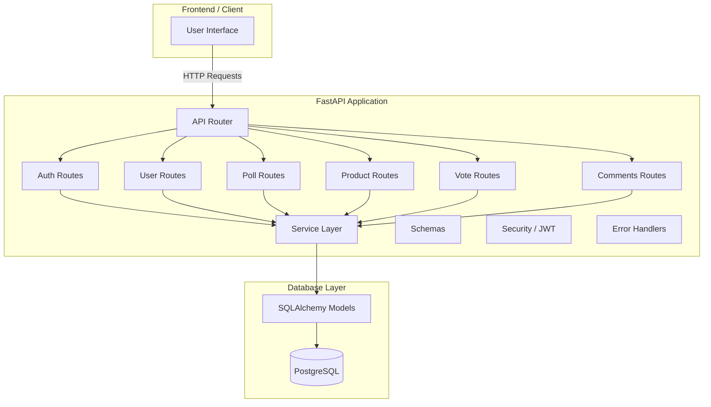

## 🎈 Choosr API - FastAPI Backend for Polling and Voting


A FastAPI backend for creating collaborative polls and event-based voting. Users can share event links, add products using search Amazon API, and vote on their favorites, making group decision-making simple and interactive. Features JWT authentication, PostgreSQL with SQLAlchemy ORM, clean architecture, and full CRUD support—perfect for event planning, group shopping, and collaborative voting apps.

## 🔐 Authentication & Access Control
The app uses JWT (JSON Web Token) authentication to secure all endpoints. Only registered users can access the application, create polls, add items, or vote.
* Users must register and log in to receive a JWT token.
* The token must be included in the Authorization header for every request:
```
Authorization: Bearer <your_token_here>
```
* Access to endpoints is controlled via FastAPI middleware and dependency injection, ensuring that unauthenticated users cannot interact with the app.


## ⭐️ Features
Core Features

* ⚡ FastAPI with fully async endpoints
* 🔐 JWT-based authentication
* 👤 User registration & login
* 🗳️ Poll creation, sharing, and real-time voting
* ➕ Add products to polls
* 🔍 Product search via external API (Amazon Search API)
* 💬 Commenting system
* 🔗 Sharable poll links for participants

Technical Features

* 🐘 PostgreSQL database (SQLAlchemy ORM)
* 📦 Clean, modular architecture (routes → schemas → services → managers)
* 🐳 Dockerized for production
* 📡 Deployed on Render (app + PostgreSQL)
* 🔁 CI/CD via GitHub → Render automatic deploy

## ☁️ Deployment
The project is deployed and running on Render.com using:
* Dockerized FastAPI app
* Render PostgreSQL database
* Continuous deployment from GitHub
Render handles automatic builds and deployments on each push to the main branch.

## ⚙️ Requirements
* Python 3.11+
* PostgreSQL 12+
* Docker (optional)
Install the dependencies with pip:
```
pip install -r requirements.txt
```
Run server:
```
uvicorn main:app --reload
```
Run with Docker:
```
docker build -t choosr-api .
docker run -p 8000:8000 choosr-api
```

## 🌳 Project Structure
```
choosr_API_project/
├── app/
│   ├── __init__.py
│   ├── api/
│   │   ├── __init__.py
│   │
│   │   ├── routes/
│   │   │   ├── __init__.py
│   │   │   ├── auth.py
│   │   │   ├── comments.py
│   │   │   ├── poll.py
│   │   │   ├── product.py
│   │   │   ├── search.py
│   │   │   ├── user.py
│   │   │   └── vote.py
│   │
│   │   ├── schemas/
│   │   │   ├── __init__.py
│   │   │   ├── auth.py
│   │   │   ├── comments.py
│   │   │   ├── poll.py
│   │   │   ├── product.py
│   │   │   ├── user.py
│   │   │   └── vote.py
│   │
│   │   ├── services/
│   │   │   ├── __init__.py
│   │   │   ├── comment_manager.py
│   │   │   ├── poll_manager.py
│   │   │   ├── product_manager.py
│   │   │   ├── user_manager.py
│   │   │   └── vote_manager.py
│   │
│   │   └── dependencies.py
│   │
│   ├── core/
│   │   ├── __init__.py
│   │   ├── config.py
│   │   ├── errors.py
│   │   └── security.py
│
│   ├── db/
│   │   ├── __init__.py
│   │   ├── database.py
│   │   └── models.py
│
│   └── utils/
│       └── __init__.py
│       └── products.py
│
├── .dockerignore
├── .env
├── .gitignore
├── Dockerfile
├── main.py
├── README.md
└── requirements.txt
```
## 🧱 Architecture Diagram



## 🔖 Notes
* 🔑 Keep sensitive data in .env (never commit it).
* 🚫 Use .gitignore and 🐋 .dockerignore to avoid uploading unnecessary or secret files.
* 🚀 You can run the app via uvicorn app.main:app --reload locally or use Docker for production.

## 📌 Dependencies

```
fastapi==0.118.0
uvicorn==0.37.0
SQLAlchemy==2.0.44
psycopg2==2.9.11
python-dotenv==1.1.1
pydantic-settings==2.11.0
pydantic==2.11.10
python-multipart==0.0.20
email-validator==2.3.0
bcrypt==5.0.0
argon2-cffi==25.1.0
requests==2.32.5
PyJWT==2.10.1
```
## Dependency Highlights
* JWT / Authentication: PyJWT and bcrypt handle token encoding/decoding and password hashing
* FastAPI / ASGI server: fastapi + uvicorn for high-performance async API serving
* Database: SQLAlchemy + psycopg2 (PostgreSQL driver)
* Environment variables: python-dotenv for managing environment configs
* Email validation: email-validator for user registration forms
