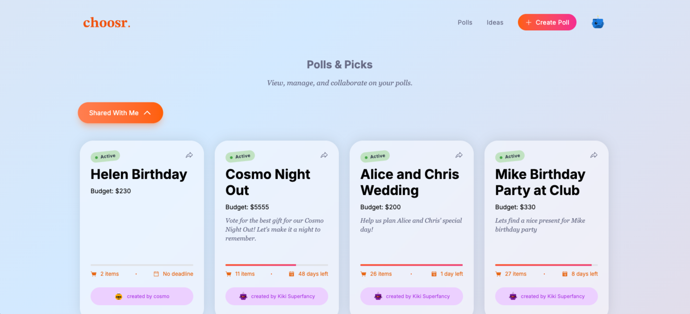
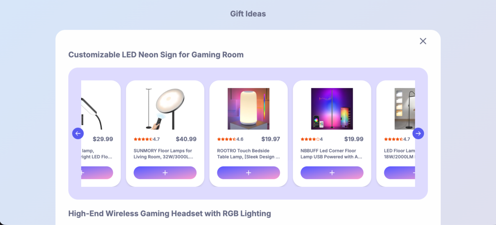

# 🎈 Choosr — Collaborative Polls & Event Voting App


<table>
  <tr>
    <td></td>
    <td></td>
    <td></td>
  </tr>
</table>


A full-stack app with a **FastAPI** backend and **React + TypeScript** frontend for creating collaborative polls and event-based voting. Users can share event links, add products via Amazon Search API, get **AI-powered gift suggestions via Google Gemini**, and vote on their favorites — making group decision-making simple and interactive.

Features JWT authentication, PostgreSQL with SQLAlchemy ORM, Redis caching, Alembic migrations, automated poll deadline management, and full CRUD support. Perfect for event planning, group shopping, and collaborative voting apps.

> 🌐 **Frontend:** `https://choosr-pied.vercel.app/` &nbsp;|&nbsp; 📡 **API Docs:** [choosr-api.onrender.com/docs](https://choosr-api.onrender.com/docs)


## 🔐 Authentication & Access Control

The app uses **JWT** authentication to secure all endpoints. Only registered users can access the application, create polls, add items, or vote.

* Users must register and log in to receive a JWT token
* The token must be included in the `Authorization: Bearer <token>` header for every request
* Access to endpoints is controlled via FastAPI **middleware and dependency injection**, ensuring unauthenticated users cannot interact with the app


## ⭐️ Features

### Core Features

- ⚡ FastAPI with async endpoints
- 🔐 JWT-based authentication
- 🔑 Poll owners can edit and delete their own polls — any user with a shared link can add products, vote, and comments
- 🧩 Pydantic models for data validation
- 🛡️ Authentication enforced via middleware
- 🔧 Dependency injection for users, database access, and services
- 🛍️ Product management in polls, including commenting and voting
- 🔍 Product search via external API (Amazon Search API)
- ⏰ **Cron job** for automatic poll deadline checking and closing
- 🔴 **Redis** caching for search results (faster responses, reduced API calls)
- 🤖 **Gemini AI suggestions** — fill out a form about the event and person, 
  and get personalized gift ideas generated by Google Gemini
- 💾 Save AI-generated ideas to your account and reuse them anytime

### Technical Features

- 🐘 PostgreSQL database (SQLAlchemy ORM)
- 🗃️ **Alembic** – Database schema migrations
- 📦 Clean, modular architecture (routes → schemas → services → repositories)
- 🐳 Dockerized for production
- ⚛️ React – Component-based UI
- 🟦 TypeScript – Strong typing and safer code
- 🎨 **Tailwind CSS** – Utility-first styling
- 🔷 **Zod** – Schema-based input validation on the frontend
- 🧩 **@phosphor-icons/react** – Consistent, lightweight icon system
- 📡 Backend deployed on **Render** (app + PostgreSQL)
- 🚀 Frontend deployed on **Vercel**
- 🔁 CI/CD via GitHub → Render & Vercel automatic deploy


## 🧪 Testing

This project includes **unit and integration tests** for the backend (pytest) and **end-to-end tests** for the frontend (Cypress).

## ☁️ Deployment

| Service            | Platform                |
|--------------------|-------------------------|
| 🐍 FastAPI Backend | Render (Dockerized)     |
| 🗄️ PostgreSQL      | Render managed database |
| ⚛️ React Frontend  | Vercel                  |
| 🔴 Redis           | Render Redis            |

Render handles automatic builds and deployments on each push to the `main` branch. Vercel auto-deploys the frontend on every commit.

---

## ⚙️ Requirements

- Python **3.11+**
- PostgreSQL **12+**
- Redis
- Node.js **18+**
- Docker *(optional)*

### Backend setup

```bash
pip install -r requirements.txt
alembic upgrade head
uvicorn main:app --reload
```

### Frontend setup

```bash
npm install
npm run dev
```

### Run with Docker

```bash
docker build -t choosr-api .
docker run -p 8000:8000 choosr-api
```

## 🗄️ Database Schema
 
The app uses **8 tables** with clear separation of concerns:
 
| Table | Purpose |
|-------|---------|
| `users` | Registered accounts |
| `polls` | Events with budget, deadline, and UUID share link |
| `products` | Items added to polls via Amazon search |
| `votes` | Per-user vote on a product |
| `comments` | Per-user comment on a product |
| `activities` | Tracks which users have joined a poll (unique per user+poll) |
| `history` | Stores Gemini AI search sessions (JSONB titles) |
| `ideas` | AI-generated gift ideas saved by the user, stored as JSONB with tags — GIN-indexed for fast filtering |
 
**Key relationships:**
- A `user` owns many `polls`, `products`, `votes`, `comments`, `activities`, `history` entries, and `ideas`
- A `poll` contains many `products` and tracks participant `activities` and `history`
- A `product` receives many `votes` and `comments`
- A `history` entry (Gemini session) links to many saved `ideas`
- `ideas` can optionally be detached from their source history (`SET NULL` on delete)


## 🔖 Notes

* 🔑 Keep sensitive data in `.env` — never commit it
* 🚫 Use `.gitignore` and 🐋 `.dockerignore` to avoid uploading unnecessary or secret files
* 🚀 Run locally via `uvicorn app.main:app --reload` or use Docker for production parity
* 🔴 Ensure Redis is running locally before starting the server (`redis-server`)
* 🗃️ Always run `alembic upgrade head` after pulling new migrations


## 📌 Dependencies

```
fastapi==0.118.0
uvicorn==0.37.0
SQLAlchemy==2.0.44
psycopg2==2.9.11
python-dotenv==1.1.1
pydantic-settings==2.11.0
pydantic==2.11.10
python-multipart==0.0.20
email-validator==2.3.0
bcrypt==5.0.0
argon2-cffi==25.1.0
requests==2.32.5
PyJWT==2.10.1
alembic
redis
apscheduler
```

### Dependency Highlights

| Package                   | Purpose                                      |
|---------------------------|----------------------------------------------|
| `PyJWT` + `bcrypt`        | Token encoding/decoding and password hashing |
| `fastapi` + `uvicorn`     | High-performance async API + ASGI server     |
| `SQLAlchemy` + `psycopg2` | ORM + PostgreSQL driver                      |
| `alembic`                 | Database schema versioning and migrations    |
| `redis`                   | Caching Amazon search results                |
| `apscheduler`             | Cron job for poll deadline management        |
| `python-dotenv`           | `.env` file management                       |
| `email-validator`         | Email format validation on registration      |

---

<div align="center">
  <sub>Built with ❤️ using FastAPI + React</sub>
</div>